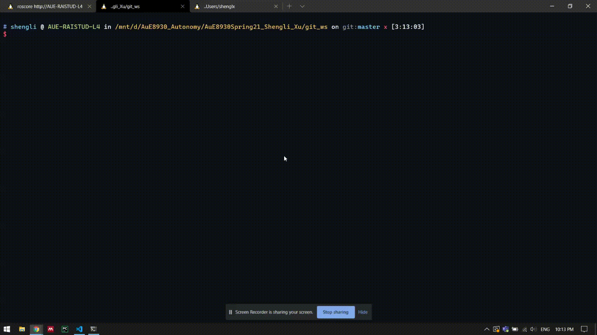
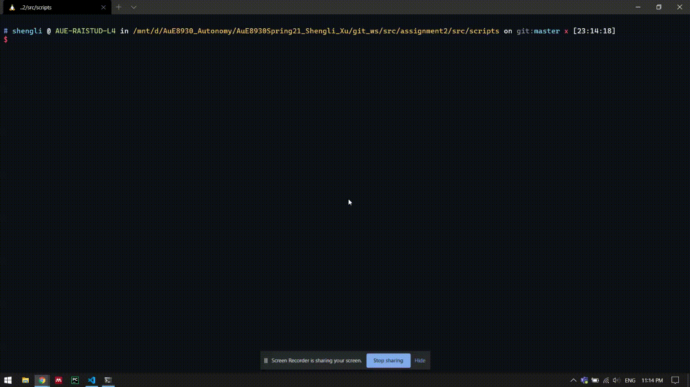

## Assignments of AuE8930 Autonomy

This project is used to save assignments of AuE8930 Autonomy.

### About Me

I'm [Shengli Xu](https://www.linkedin.com/in/shengli-xu-8471a618b/), a Ph.D. student working with Dr. Rai at CU-ICAR. Intelligent control based on Deep Learning is my current research topic due to my academic background of Control Engineering.

### Description

A single **git_ws** folder which contains all assignments is maintained. The structure of the project is shown below.

```
📦git_ws
┣ 📂src
┃ ┣ 📂assignment2
┃ ┃ ┣ 📂src
┃ ┃ ┃ ┣ 📂launch
┃ ┃ ┃ ┃ ┣ 📜circle.launch
┃ ┃ ┃ ┃ ┣ 📜square_closedloop.launch
┃ ┃ ┃ ┃ ┗ 📜square_openloop.launch
┃ ┃ ┃ ┗ 📂scripts
┃ ┃ ┃ ┃ ┣ 📜circle.py
┃ ┃ ┃ ┃ ┣ 📜square_closedloop.py
┃ ┃ ┃ ┃ ┗ 📜square_openloop.py
┃ ┃ ┣ 📜CMakeLists.txt
┃ ┃ ┗ 📜package.xml
┣ 📂screenshots
┃ ┣ 📜assignment2_circle_screenshot.png
┃ ┣ 📜assignment2_square_closedloop_screenshot.png
┃ ┗ 📜assignment2_square_openloop_screenshot.png
┣ 📂videos
┃ ┣ 📜assignment2_circle.mp4
┃ ┣ 📜assignment2_square_closedloop.mp4
┃ ┗ 📜assignment2_square_openloop.mp4
┗ 📜.catkin_workspace
```

### Assignment 2

#### Make the Turtle move in a circle with constant twist velocity



#### Make the Turtle move in a square without velocity control



#### Make the Turtle move in a square with velocity control


### Running

- Clone the project

```bash
$ git clone git@github.com:victoryfb/AuE8930Spring21_Shengli_Xu.git
```

- Build code in a catkin workspace `git_ws`

```bash
$ cd ./AuE8930Spring21_Shengli_Xu/git_ws
$ catkin_ws
```

- Make the node executable

```bash
$ cd ./AuE8930Spring21_Shengli_Xu/git_ws/src/assignment2/src/srcipts
$ chmod u+x *.py
```

- Launch ROS nodes in the `assignment2`

```bash
$ roslaunch assignment2 circle.launch radius:=1 angular_velocity:=1 number_of_turms:=2
```
