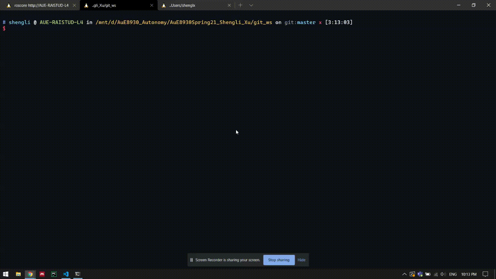
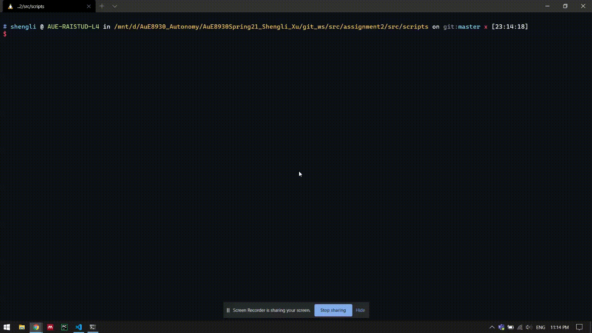
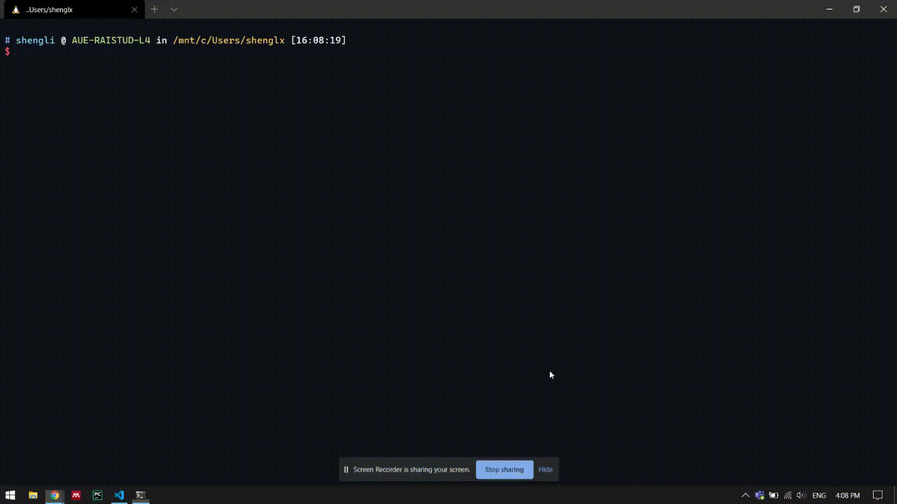

### Assignment 2

#### circle.py

Make the Turtle move in a circle with constant twist velocity



#### square_openloop.py

Make the Turtle move in a square without velocity control



#### square_closedloop.py

Make the Turtle move in a square with velocity control



### Running

- Clone the project

```bash
$ git clone git@github.com:victoryfb/AuE8930Spring21_Shengli_Xu.git
```

- Build code in a catkin workspace `git_ws`

```bash
$ cd ./AuE8930Spring21_Shengli_Xu/git_ws
$ catkin_make
$ source ./git_ws/devel/setup.bash
```

- Make the node executable

```bash
$ cd ./AuE8930Spring21_Shengli_Xu/git_ws/src/assignment2/src/srcipts
$ chmod u+x *.py
```

- Launch ROS nodes in the `assignment2`

```bash
$ roslaunch assignment2 circle.launch radius:=1 angular_velocity:=1 number_of_turms:=2
$ roslaunch assignment2 square_openloop.launch speed:=0.2 angular_velocity:=0.2 square_length:=2
$ roslaunch assignment2 square_closedloop.launch tol:=0.1
```
