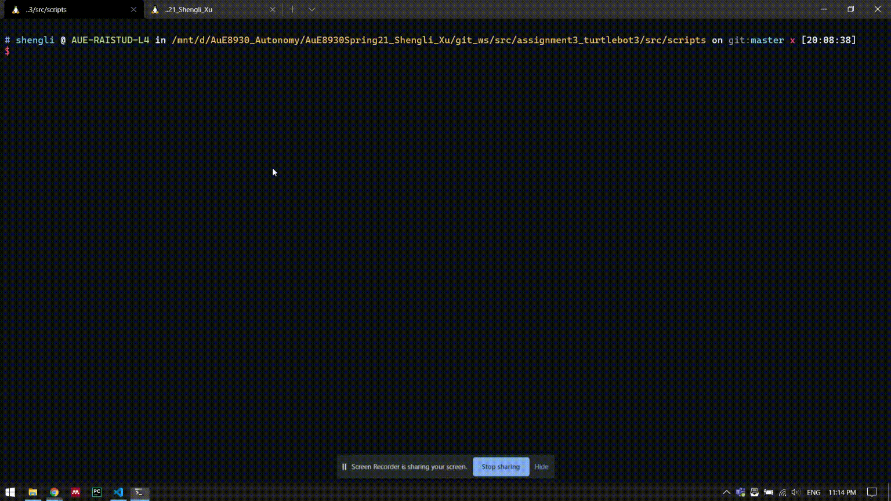

### Assignment 3

#### circle.py

Make the TurtleBot3 move in a circle with constant twist velocity


#### square.py

Make the TurtleBot3 move in a square with 0.3 angular velocity and 0.3 linear velocity in open loop


#### emergency_braking.py

Make the TurtleBot3 stop when it gets too close to the wall



### Running

- Clone the project

```bash
$ git clone git@github.com:victoryfb/AuE8930Spring21_Shengli_Xu.git
```

- Build code in a catkin workspace `git_ws`

```bash
$ cd ./AuE8930Spring21_Shengli_Xu/git_ws
$ catkin_make
$ source ./git_ws/devel/setup.bash
```

- Make the node executable

```bash
$ cd ./AuE8930Spring21_Shengli_Xu/git_ws/src/assignment3_turtlebot3/src/srcipts
$ chmod u+x *.py
```

- Launch ROS nodes in the `assignment3_turtlebot3`

```bash
$ roslaunch assignment3_turtlebot3 move.launch code:=circle
$ roslaunch assignment3_turtlebot3 move.launch code:=square
$ roslaunch assignment3_turtlebot3 emergency_braking.launch
```
